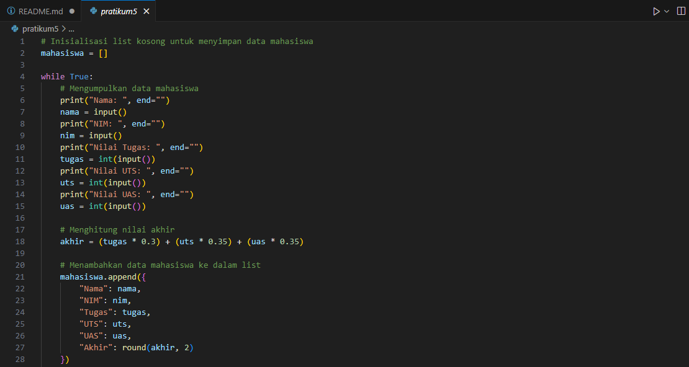
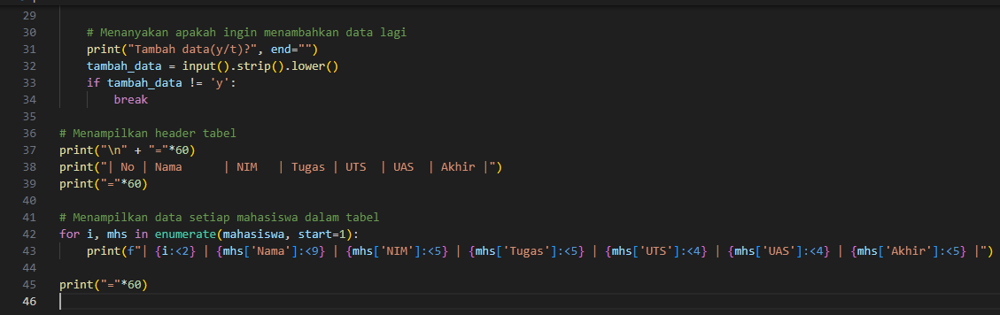
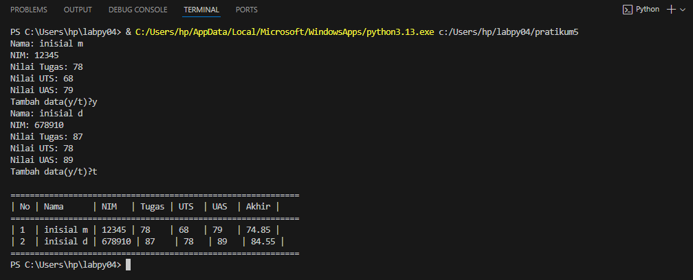
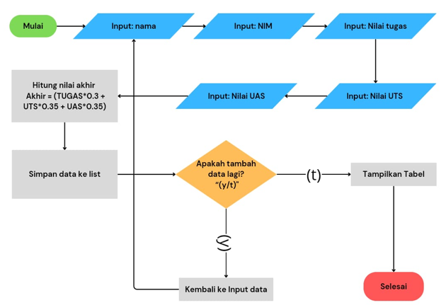
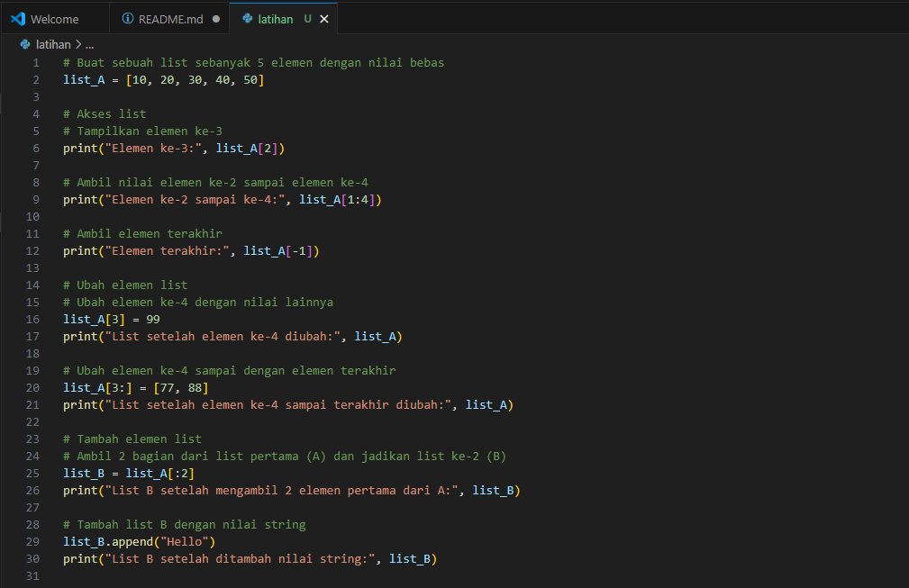
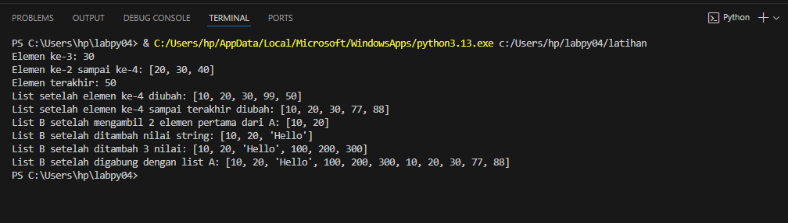

# Program sederhana untuk menambahkan data kedalam sebuah list
**Contoh Input Program Python3 (Vs code)**

**Penjelasan program:**
1.	Program mengumpulkan data setiap mahasiswa (Nama, NIM, Nilai Tugas, Nilai UTS, dan Nilai UAS), pada variabel mahasiswa yang masih kosong.
2.	Program menghitung nilai akhir pada variabel (Akhir) berdasarkan rata-rata dari tiga nilai yang diberikan.
3.	Data setiap mahasiswa ditambahkan ke dalam list mahasiswa, di mana setiap mahasiswa diwakili sebagai dictionary.
4.	Pengguna dapat menambahkan data mahasiswa lain dengan mengetik "y" ketika output "Tambah data(y/t)?" dan “t” untuk berhenti.
5.	Setelah semua data dimasukkan, program akan menampilkan tabel berisi data lengkap semua mahasiswa.

**Contoh Output penggunaan**

### Flowchart

**Penjelasan flowchart**

1.	Mulai: Program dimulai.
2.	Input Nama, NIM, Nilai Tugas, UTS, dan UAS: Pengguna memasukkan data untuk setiap mahasiswa.
3.	Hitung Nilai Akhir: Program menghitung nilai akhir berdasarkan formula (Tugas*0.3 + UTS*0.35 + UAS*0.35).
4.	Simpan Data ke List: Data mahasiswa disimpan ke dalam list.
5.	Tambah data lagi?: Program menanyakan apakah ingin menambah data mahasiswa lagi. Jika "y", kembali ke langkah input data. Jika "t", lanjut ke langkah berikutnya.
6.	Tampilkan Tabel: Program menampilkan data mahasiswa dalam bentuk tabel.
7.	Selesai: Program berakhir.

# Latihan
**Contoh Input Program Python3 (Vs code)**

**Penjelasan code program**

1. list_A adalah list awal dengan 5 elemen.
2. Bagian "akses list" berisi contoh mengambil elemen tertentu dan mengakses bagian tertentu dari list.
3. Bagian "ubah elemen list" menunjukkan cara mengganti elemen ke-4 dengan nilai lain serta mengganti elemen ke-4 sampai terakhir.
4. Bagian "tambah elemen list" menunjukkan cara membuat list baru list_B dengan beberapa elemen dari list_A, menambahkan elemen string, menambah 3 nilai numerik, dan menggabungkan list_A ke list_B.

**Contoh Output**

